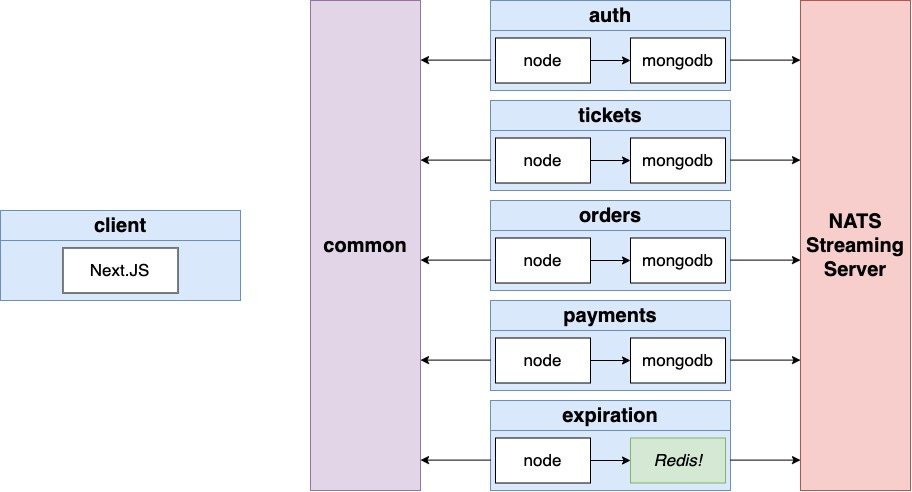

# Details

<details open> 
  <summary>Click to Contract/Expend</summary>

## Section 5 - Architecture of Multi-Service Apps

### 105. Big Ticket Items

Painful Things from App #1 (blog)

1. Lots of duplicated code
   - Build a central library as an NPM module to share code between our different projects
2. Really hard to picture the flow of events between services
   - Precisely define all our events in this shared library
3. Really hard to remember what properties an event should have
   - Write everything in Typescript
4. Really hard to test some event flows
   - Write tests for as much as possible/reasonable
5. My machine is getting laggy running kubernetes and everything else...
   - Run a k8s cluster in the cloud and develop on it almost as quickly as local
6. What if someone created a comment after editing 5 others after editing a post while balancing on a tight rope...
   - Introduce a lot of code to handle concurrency issues

### 106. App Overview

1. Users can list a ticket for an event (convert, sports) for sale
2. Other users can purchase this ticket
3. Any user can list tickets for sale and purchase tickets
4. When a user attempts to purchase a ticket, the ticket is "locked" for 15 minutes. The user has 15 minutes to enter their payment info.
5. While locked, no other user can purchase the ticket. After 15 minutes, the ticket should "unlock"
6. Ticket prices can be edited if they are not locked

### 108. Service Types

- auth: Everything related to user signup/signin/signout
- tickets: Ticket creation/editing. Knows whether a ticket can be updated
- orders: Order creation/editing
- expiration: Watchers for orders to be created, cancels them after 15 minutes
- payments: Handles credit card payments. cancels orders if payments fails, completes if payment succeeds

### 109. Events and Architecture Design



### 111. Auth Service Setup

```sh
mkdir ticketing
cd ticketing
mkdir auth
cd auth
npm init -y
npm install typescript ts-node-dev express @types/express
npm install -g typescript
tsc --init
```

###

```sh
# install minikube first
# https://minikube.sigs.k8s.io/docs/start/
minikube start --driver=docker

# install skaffold
brew install skaffold

skaffold dev
# Use 'docker scan' to run Snyk tests against images to find vulnerabilities and learn how to fix them
# Build [pcsmomo/auth] succeeded
# Tags used in deployment:
#  - pcsmomo/auth -> pcsmomo/auth:94009c663348b62439f9a33209d2626eb2b0fc75a8493782d90e1b6687f4ac2a
# Starting deploy...
# Cleaning up...
# WARN[0032] deployer cleanup:kubectl create: running [kubectl --context minikube create --dry-run=client -oyaml -f /Users/noah/Documents/study/study_codes/udemy/microservices-node-react/microservices-node-react-git/05-architecture-micro-service-app/ticketing/infra/k8s/auth-depl.yaml]
#  - stdout: ""
#  - stderr: "error: error validating \"/Users/noah/Documents/study/study_codes/udemy/microservices-node-react/microservices-node-react-git/05-architecture-micro-service-app/ticketing/infra/k8s/auth-depl.yaml\": error validating data: ValidationError(Deployment.spec.selector): unknown field \"app\" in io.k8s.apimachinery.pkg.apis.meta.v1.LabelSelector; if you choose to ignore these errors, turn validation off with --validate=false\n"
#  - cause: exit status 1  subtask=-1 task=DevLoop
# kubectl create: running [kubectl --context minikube create --dry-run=client -oyaml -f /Users/noah/Documents/study/study_codes/udemy/microservices-node-react/microservices-node-react-git/05-architecture-micro-service-app/ticketing/infra/k8s/auth-depl.yaml]
#  - stdout: ""
#  - stderr: "error: error validating \"/Users/noah/Documents/study/study_codes/udemy/microservices-node-react/microservices-node-react-git/05-architecture-micro-service-app/ticketing/infra/k8s/auth-depl.yaml\": error validating data: ValidationError(Deployment.spec.selector): unknown field \"app\" in io.k8s.apimachinery.pkg.apis.meta.v1.LabelSelector; if you choose to ignore these errors, turn validation off with --validate=false\n"
#  - cause: exit status 1
```

> cannot go further...

</details>
