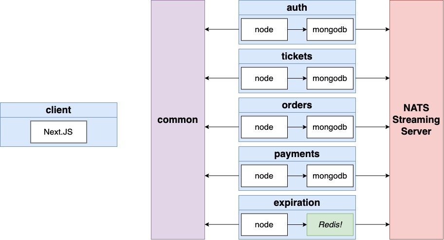

# Details

 
  
Click to Contract/Expend

## Section 5 - Architecture of Multi-Service Apps

### 105. Big Ticket Items

Painful Things from App #1 (blog)

1. Lots of duplicated code
   - Build a central library as an NPM module to share code between our different projects
2. Really hard to picture the flow of events between services
   - Precisely define all our events in this shared library
3. Really hard to remember what properties an event should have
   - Write everything in Typescript
4. Really hard to test some event flows
   - Write tests for as much as possible/reasonable
5. My machine is getting laggy running kubernetes and everything else...
   - Run a k8s cluster in the cloud and develop on it almost as quickly as local
6. What if someone created a comment after editing 5 others after editing a post while balancing on a tight rope...
   - Introduce a lot of code to handle concurrency issues

### 106. App Overview

1. Users can list a ticket for an event (convert, sports) for sale
2. Other users can purchase this ticket
3. Any user can list tickets for sale and purchase tickets
4. When a user attempts to purchase a ticket, the ticket is "locked" for 15 minutes. The user has 15 minutes to enter their payment info.
5. While locked, no other user can purchase the ticket. After 15 minutes, the ticket should "unlock"
6. Ticket prices can be edited if they are not locked

### 109. Events and Architecture Design

