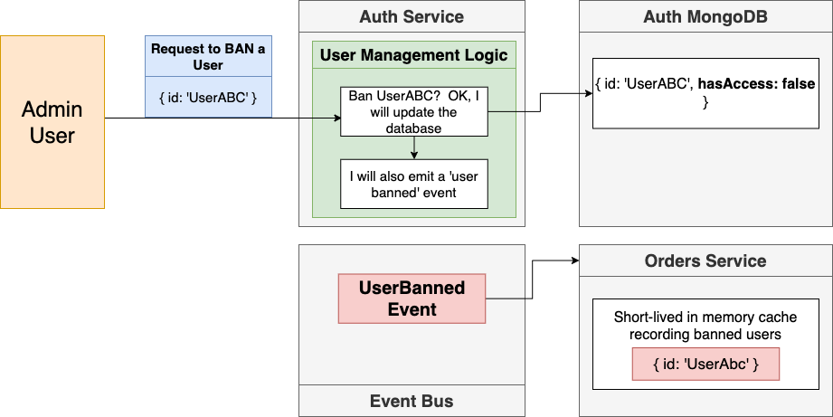

# Details

<details open> 
  <summary>Click to Contract/Expend</summary>

## Section 7 - Response Normalization Strategies

```sh
# ticketing
minikube tunnel
skaffold dev
```

### 134. Adding Validation

```sh
npm install --save express-validator
```

### set up swagger on express

```sh
npm install --save express
npm install --save swagger-ui-express swagger-jsdoc
npm install --save-dev @types/swagger-ui-express @types/swagger-jsdoc
```

### 135. Handling Validation Errors

Check the validation using postman, https://tickets.dev/api/users/signup

### 136. Postman HTTPS Issues

Turn off the postman `SSL certificate verification option` in Settings

### 137. Surprising Complexity Around Errors

If services in different language (node, python, java, etc.) and using different libraries \
would send different structure of error messages

This has been an issue at my work.

The solution in this lecture is to have consistent structure from the backends

Then React App doesn't need to handle those different structures of error messages!

### 139. Solution for Error Handling

- Write an error handling middleware
- Make sure w ecapture all possible erros using Express's error handling mechanism (call the `next` function!)

[Express Error Handling](https://expressjs.com/en/guide/error-handling.html)

1. Synchronous erorr handler
2. Asynchronous route handler

#### E.G. Writing error handlers

```js
app.use((err, req, res, next) => {
  console.error(err.stack);
  res.status(500).send('Something broke!');
});
```

### skaffold reloading doesn't work sometimes

```sh
# Output in verbose mode
scaffold dev -v debug
```

### 147. Verifying Our Custom Errors

- Option #1: Using `interface` in typescript feature
- \*Option #2: Using `abstract class` in vanila javascript feature
  - Why he chose to use Abstract Class over Typescript Interface?
  - -> Because it is javascript feature (not typescript) so we can use it in `instanceof` checks!!!

### 150. Uh Oh... Async Error Handling

```js
// this works
app.all('*', async (req, res, next) => {
  next(new NotFoundError());
});
```

However the `next` keyword is quite dependent to `express.js`\
So if you don't want to use it, install a small library

```sh
npm install --save express-async-errors
```

## Section 8 - Database Management and Modeling

### 152. Creating Databases in Kubernetes

```sh
npm install mongoose
```

After setup `auth-mongo-depl.yaml` skaffold automatically applies deployment and service.

```sh
k get pods
# NAME                               READY   STATUS    RESTARTS   AGE
# auth-depl-78b8f69dc5-gnnz2         1/1     Running   0          3m19s
# auth-mongo-depl-5f4498964f-hbbck   1/1     Running   0          105s
```

### 155. Getting TypeScript and Mongoose to Cooperate

- Issue #1: Typescript wants to make sure we are providing the correct properties
  - Mongoose does not make this easy
- Issue #2: The properties that we pass to the User contructor don't necessarily match up with the properties available on a user

## Section 9 - Authentication Strategies and Options

### 169. Fundamental Authentication Strategies

- Fundamental Option #1: Individual services rely on the auth service
  - Pros: changes to auth state are immedately reflected
  - Cons: Auth service goes down? Entire app is broken
- Fundamental Option #1.1: Individual services rely on the auth service as a gateway
- \*Fundamental Option #2: Individual services know how to authenticate a user
  - Pros: Auth service is down? Who cares!
  - Cons: Some user got banned? Darn, I just gave them the keys to my car 5 minutes ago...

### 171. So Which Option?

> We are going with Option #2 to stick with the idea of independent services

### 172. Solving Issues with Option #2

- Add a logic to check JWT, Cookie is viable to all the services
- and Auth service will have the token refresh logic
- To enhance this, send UserBannedEvent to Event Bus



> However, we would not implement this issue solving part in this project

### 174. Microservices Auth Requirements

#### Differences between Cookies and JWTs

- Cookies
  - Transport mechanism
  - Moves any kind of data between browser and server
  - Automatically managed by the browser
- JWT's
  - Authentication/Authorization mechanism
  - Stores any data we want
  - We have to manage it manually

#### Options to deliver my JWT

- Headers/Authorization
- Body/token
- Headers/Cookie

### 175. Issues with JWT's and Server Side Rendering

#### Communications for Normal React App

- 1st: to React app
  - Request: GET ticketing.dev
  - Response: HTML file with some script tags
- 2nd: to React app
  - Request: I need JS files
  - Response: JS Files
- 3rd: to Orders Service
  - This is where we need JWT
  - Request: I need data
  - Response: Orders Data

#### Communications for Next Js APP

- 1st: to NextJs App
  - JWT is needed
  - Request: GET ticketing.dev
    - Next to Orders Service
      - Request: I need data
      - Response: Orders Data
  - Response: Fully rendered HTML file with content

### 177. Adding Session Support

```sh
# ticketing/auth
npm install --save cookie-session
npm install --save-dev @types/cookie-session
```

### 178. Generating a JWT

```sh
# ticketing/auth
npm install --save jsonwebtoken
npm install --save-dev @types/jsonwebtoken
```

#### Test in postman

- Create a new user in https://ticketing.dev/api/users/signup
- Check the response Cookie tab
  - session: (base 64 incoded) { jwt: <JWT token>}
  - as we stored it as
    ```js
    req.session = {
      jwt: userJwt,
    };
    ```

### 179. JWT Signing Keys

- base64 Decode whole session value
  - https://www.base64decode.org/
- take the jwt value and check it in jwt.io with temporary secret key `asdf`
  - https://jwt.io/

</details>
