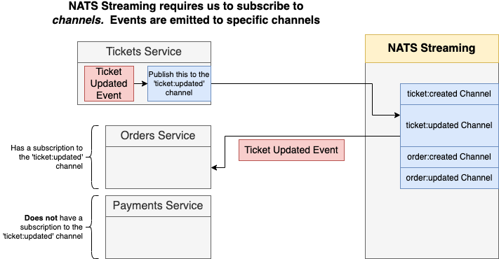
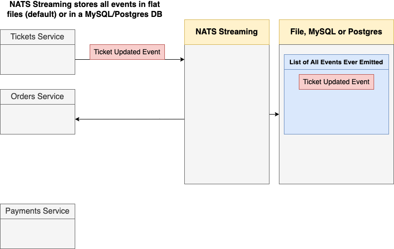

# Details

<details open> 
  <summary>Click to Contract/Expend</summary>

# How to run

```sh
minikube tunnel

# ./ticketing/client
docker build -t pcsmomo/client .
docker push pcsmomo/client # skaffold pull the image from here

# ./ticketing
skaffold dev

kubectl create secret generic jwt-secret --from-literal=JWT_KEY=asdf
```

add `127.0.0.1 ticketing.dev` to /etc/hosts

```sh
# temporarily port forwarding NATS services
k get pods

# NATS client
k port-forward nats-depl-588b8b6b8-2s9nt 4222:4222

# NATS mornitoring service (not necessary. For debugging)
k port-forward nats-depl-588b8b6b8-2s9nt 8222:8222
```

```sh
# NATS publisher and listener in separated tabs
npm run publish
npm run listen # x2 or x3, for more listener(=consumer)
```

## Section 14: NATS Streaming Server - An Event Bus Implementation

### 295. Three Important Items

- [NATS.io Docs](https://docs.nats.io/)
- [STAN aka 'NATS Streaming' Docs](https://docs.nats.io/legacy/stan)
- `NATS` and `NATS Streaming Server` are two different things
  - NATS Streaming Server is top of NATS and we will use NATS Streaming Server in this course
- NATS Streaming implements some extraordinarily important design decisions that will affect our app
- We are going to run the official `nats-streaming` docker image in kubernetes. Need to read the image's docs
  - https://hub.docker.com/_/nats-streaming : Commandline Options

> WARNING Deprecation Notice \
> The NATS Streaming Server is being deprecated. Critical bug fixes and security fixes will be applied until June of 2023.\
> NATS-enabled applications requiring persistence should use [JetStream](https://docs.nats.io/nats-concepts/jetstream).

### 297. Big Notes on NATS Streaming

[npm node-nats-streaming](https://www.npmjs.com/package/node-nats-streaming)





### 298. Building a NATS Test Project

#### Short term goal

1. Create a new sub-project with typescript support
2. Install node-nats-streaming library and connect to nats streaming server
3. We should have two npm scripts, one to emit events, and one to listen for events
4. This program will be ran outside of kubernetes!

```sh
# ./ticketing
mkdir nats-test
cd nats-test
npm init -y
npm install node-nats-streaming ts-node-dev typescript @types/node

tsc --init
```

### 299. Port-Forwarding with Kubectl

- Option #1: Publisher Program - (Ingress-Nginx - NATS ClusterIP Service - NATS Pod)
  - a bit too heavy for our case
- Option #2: Publisher Program - (NodePort Service - NATS Pod)
  - creating a config file is still too much
- **Option #3**: Publisher Program - (Port-Forward Port 4222 - NATS Pod)
  - Great for temporary connection!!
  - Need to keep the terminal open

```sh
kubectl get pods
# NAME                                  READY   STATUS    RESTARTS   AGE
# ...
# nats-depl-689cdd9577-flmx7            1/1     Running   0          41m
kubectl port-forward nats-depl-689cdd9577-flmx7 4222:4222
# Forwarding from 127.0.0.1:4222 -> 4222
# Forwarding from [::1]:4222 -> 4222

# Keep the terminal open
```

```sh
# ./ticketing/nats-test
npm run publish
# [INFO] 22:56:46 ts-node-dev ver. 2.0.0 (using ts-node ver. 10.9.1, typescript ver. 4.9.5)
# Publisher connected to NATS
```

### 302. Listening For Data

```sh
# ./ticketing/nats-test
npm run listen
# Listener connected to NATS
```

On the publisher terminal, type `rs` and enter and repeat it a few more times

```sh
# ./ticketing/nats-test
npm run publish
rs
# Enter
```

The server restarts and it publishes a few more messages

### 304. Client ID Generation

Open a new terminal and run another listener

```sh
# ./ticketing/nats-test
npm run listen
# Error: Unhandled error. ('stan: clientID already registered')
```

Every connection has `clientID` and we've set the clientID, "123" for listener\
Now we want it random IDs

### 305. Queue Groups

It looks like as the same concept as Kafka Consumer Group

### 306. Manual Ack Mode

While consuming a message if the process fails (db connection issue, etc), we want to re-consume the message.

```js
// the defualt is false
const options = stan.subscriptionOptions().setManualAckMode(true);
// as default, after 30s timeout if we don't acknowledge back,
// the message will be re-consumed on the next listener
```

### 307. Client Health Checks

Sometimes, the listerner couldn't consume a message hung somewhere and the next message is processed first.\
To investigate it, check the the monitor service

```sh
# In a new terminal
kubectl port-forward nats-depl-58d8b8d57d-6csgg 8222:8222
```

navigate, http://localhost:8222/streaming

- [clients](http://localhost:8222/streaming/clientsz)
- [channels](http://localhost:8222/streaming/channelsz)
  - http://localhost:8222/streaming/channelsz?subs=1

#### What's happening?

- In the `?subs=1` URL, we can see two subscriptions.
- if we restart, `rs` a listner and refresh the page, we can see 3 subscriptions.
- nats-streaming-server expects the lost connection to be back and wait for 30 seconds keeping the subscription.
- so this time, if a message is allocated to the disconnected subscription, it hung.

#### Possible solutions?

- Option #1. Tweak the nats-streaming docker image option
  - -hbi, --hb_interval <duration> Interval at which server sends heartbeat to a client
  - -hbt, --hb_timeout <duration> How long server waits for a heartbeat response
  - -hbf, --hb_fail_count <int> Number of failed heartbeats before server
    closes the client connection
  - > it still has a few seconds missing during health check interval
- **Option #2**. listening `close` from the code
  ```ts
  stan.on('close', () => {});
  ```
  - > It works for general cases, but it wouldn't prevent 100% shutdown issues. e.g. node server closed from Activity monitor or something.

### 315. Durable Subscriptions

```ts
// ticketing/nats-test/src/listener.ts
const options = stan.setDeliverAllAvailable().setDurableName('order-service');
stan.subscribe('', 'orders-service-queue-group', options);
```

These three options work very well

- Initially a listener consume all messages.
- when the listener restarts, it consumes messages after the last message consumed(=offset?)

## Section 15 - Connecting to NATS in a Node JS World

### 324. Enforcing Listener Subjects

```ts
subject = Subjects.TicketCreated;
```

```ts
Property 'subject' in type 'TicketCreatedListener' is not assignable to the same property in base type 'Listener<TicketCreatedEvent>'.
  Type 'Subjects' is not assignable to type 'Subjects.TicketCreated'.ts(2416)
```

If you see an error message like this, consider typing it.\
Typescript is worrying if the `subject` would be changed some other value.\

- Option #1:
  ```ts
  subject: Subjects.TicketCreated = Subjects.TicketCreated;
  ```
- Option #2:
  ```ts
  readonly subject = Subjects.TicketCreated;
  ```

### 326. Enforcing Data Types

```ts
// ./ticketing/nats-test/src/events/ticket-created-listener.ts
// correct
onMessage(data: TicketCreatedEvent['data'], msg: Message) {}

// typescript will give you warning
interface FakeData {
  name: string;
  cost: number
}
onMessage(data: FakeData, msg: Message) {}
```

### 330. Awaiting Event Publication

How to make publish method to return Promise

```js

// ./ticketing/nats-test/src/events/base-publisher.ts
// before
publish(data: T['data']) {
  this.client.publish(this.subject, JSON.stringify(data), () => {
    console.log('Event published.');
  });
}

// after
publish(data: T['data']): Promise<void> {
  return new Promise((resolve, reject) => {
    this.client.publish(this.subject, JSON.stringify(data), err => {
      if (err) {
        return reject(err);
      }
      console.log('Event published to subject', this.subject);
      resolve();
    });
  });
}

// ./ticketing/nats-test/src/publisher.ts
await publisher.publish({})
```

### 331. Common Event Definitions Summary

We will be using common event definitions in the common module as all our services are in Typescript.\
However, if you have services in different languages, this approach won't work.\

#### Alternatives with Cross Language Support

- JSON Schema
- Protobuf
- Apache Avro

### 332. Updating the Common Module

```sh
# ./ticketing/common
# udemy/microservices-node-react/dwktickets-npm/commmon
npm install node-nats-streaming

# udemy/microservices-node-react/dwktickets-npm/commmon
npm run pub
```

</details>
